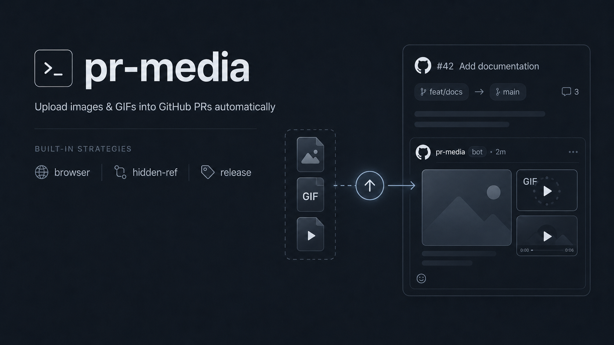

# pr-media



[](https://github.com/MatteoSchifano/gh-pr-media/actions/workflows/ci.yml)
[](./LICENSE)

**Secure media for GitHub pull requests.** Attach images, GIFs, and videos from a script, CI job, or AI agent — without extracting a browser session cookie or committing review artifacts to your branch.

GitHub has no public API for PR attachments. The endpoint the web UI uses to
mint `user-attachments/assets/<uuid>` URLs only accepts a browser session
cookie — a personal access token gets a flat `422`. The tools that work
around this do it by stealing that cookie, which hands out a bearer
credential for your *entire* GitHub account. pr-media keeps that session in the
browser and gives you deliberate upload paths with clear visibility trade-offs.

[Read the website](https://matteoschifano.github.io/gh-pr-media/) · [Install as a `gh` extension](#install-as-a-gh-extension)

## Quickstart

```bash
npm install -g pr-media
pr-media add screenshot.png before-after.gif --pr-url https://github.com/acme/widgets/pull/42
```

```
<!-- pr-media -->


```

That markdown block is also what gets posted as the PR comment (or appended
to the description, with `--to description`). Requires `gh auth login` —
see [Install](#install) below.

## Choose a route, not an upload hack

Every upload path has a visibility trade-off. Choose a strategy explicitly
when that trade-off matters; in `auto` mode, pr-media tries the viable paths
for the current environment and falls back after a strategy error:

| Review context | Recommended path | Why |
|---|---|---|
| Local work where you want GitHub's native attachment URL | `browser` | Uses the active GitHub UI without reading its cookie store. |
| Private repository, CI, or an AI agent | `hidden-ref` | Uses `gh`-managed credentials and keeps the URL behind repository access. |
| Public-repository CI or release-hosted evidence | `release` | Uses GitHub Releases; its URL is public for public repositories and requires repository access for private ones. |

This makes pr-media a good fit when the goal is not merely to host a file, but
to put review evidence in the right place with a known visibility model.

### How it differs from common upload approaches

| Capability | pr-media | Cookie-replay uploaders | Single-backend uploaders |
|---|---|---|---|
| Reads or replays a browser session cookie | Never | Typically required for native PR assets | Not required |
| Supports repository-scoped private media | Yes, with `hidden-ref` | Depends on the browser session | Depends on the chosen host |
| Works in CI and coding agents | Yes, via `gh` credentials | Poor fit for unattended environments | Depends on the backend |
| Offers a route for images, GIFs, and videos | Yes | Varies | Varies |

This is a category comparison, not a benchmark: use the strategy that matches
your repository and review context.

## Why pr-media

- **Automatic fallback in `auto` mode** — tries browser, hidden-ref, and
  release strategies in an environment-aware order; an explicitly selected
  strategy runs on its own.
- **No session-cookie extraction** — pr-media never asks you to hand over or
  replay your browser credential (see [Security model](#security-model)).
- **Works interactive and headless** — the same workflow runs on your laptop,
  in a GitHub Actions runner, or inside a coding agent.
- **Light install** — no bundled browser; `playwright-core` is *optional*,
  only needed for the CDP browser backend.
- **Built for AI agents** — `--json`, `--dry-run`, and a ready-made agent skill
  make media a reliable, scriptable proof step (see [Use with AI agents](#use-with-ai-agents)).
- **Cleans up after itself** — a `cleanup` command plus a GitHub Action
  that removes upload artifacts when a PR closes.

## Security model

Cookie-based uploaders (`gh-image`-style tools that extract your browser's
`user_session` cookie and replay it against GitHub's internal upload
endpoint) are insecure by construction: that cookie is a bearer credential
for your **entire GitHub account**, not scoped to a repo or an expiry
window the way a PAT or `gh` token is. Extracting it means reading the
browser's cookie store and passing it around — in shell history, logs, a
temp file — exfiltration paths a scoped token never creates. And it's
brittle: GitHub can reshape session cookies any time, with none of a
documented API's compatibility guarantees.

pr-media never reads a cookie store and never calls a cookie-store API:

- **Only scoped, `gh`-managed tokens.** Every non-interactive call goes
  through the `gh` CLI (`gh api`, `gh release`, `gh pr`). Authentication is
  entirely `gh`'s problem — pr-media never writes a token to disk or logs
  one.
- **The `browser` strategy reuses your session; it never reads it.** It
  drives your own, already-logged-in browser (`agent-browser` or Chrome
  DevTools Protocol), stages a file on the comment composer's file input,
  reads back the URL GitHub inserts, clears the textarea, and **never
  clicks Comment**.
- **A CI guard enforces it.** `security-guard` fails the build if
  cookie-related patterns (cookie stores, `context.cookies()`,
  `document.cookie`) show up under `src/`.
- **`execFile`, never a shell.** External commands (`gh`, `agent-browser`)
  get their arguments as an argv array, never a shell string — no command
  injection via file paths, PR URLs, or repo names.

### The three strategies

| Strategy     | Auth                                             | Produced URL                                                | Privacy                                                        | When to use it |
|--------------|---------------------------------------------------|---------------------------------------------------------------|-------------------------------------------------------------------|----------------|
| `browser`    | Your own, already-logged-in browser (`agent-browser` or CDP) — session never read | Canonical `github.com/user-attachments/assets/<uuid>`, the same URL the web UI would produce | Inherits the PR's own visibility (GitHub's attachment ACL) | Interactive/local use when you want the exact same URL a human dragging a file in would get |
| `hidden-ref` | `gh` CLI token (scoped PAT / OAuth / `GITHUB_TOKEN`), via the Git Data API | `github.com/<owner>/<repo>/blob/<sha>/<file>?raw=true` | Inherits the **repo's** visibility (private repo → URL needs repo access) | Default for most workflows, including CI, with no interactive browser required |
| `release`    | `gh` CLI token, via a dedicated prerelease's assets | `github.com/<owner>/<repo>/releases/download/...`      | Public-repository assets are public; private-repository assets require repository access | Public-repo CI, or release storage that matches the repository's access model |

`hidden-ref` and `release` never launch a browser — they go through `gh`'s
own authenticated API calls end to end.

## Use with AI agents

pr-media ships an [agent skill](./skills/pr-media) that teaches an AI
coding agent which strategy to pick and how to read `--json` output:

```bash
npx degit MatteoSchifano/gh-pr-media/skills/pr-media ~/.claude/skills/pr-media
```

Agents should default to `--json` for parseable output, and can combine it
with `--dry-run` to preview a plan before touching anything:

```bash
$ pr-media add diff.png --pr-url https://github.com/acme/widgets/pull/42 --json
[
  {
    "name": "diff.png",
    "url": "https://github.com/acme/widgets/blob/8f2a1c9/diff.png?raw=true",
    "markdown": "",
    "strategy": "hidden-ref"
  }
]
```

## Install

```bash
npm install -g pr-media
# or, without installing:
npx pr-media add ./shot.png --pr-url https://github.com/acme/widgets/pull/42
```

### Requirements

- [`gh`](https://cli.github.com), authenticated (`gh auth login`). Every
  strategy except `browser` relies on `gh` for authentication — pr-media
  never reads or stores a token itself.
- For `browser` specifically, either
  [`agent-browser`](https://www.npmjs.com/package/agent-browser) on `PATH`
  with its own logged-in profile, **or** a local Chrome running with
  remote debugging enabled plus the optional `playwright-core` dependency:
  ```bash
  "Google Chrome" --remote-debugging-port=9222 \
    --user-data-dir="$HOME/Library/Application Support/Google/Chrome"
  npm install playwright-core
  ```
  (override the endpoint with `PR_MEDIA_CDP_URL` if it's not
  `http://localhost:9222`).

### Install as a `gh` extension

```bash
gh extension install MatteoSchifano/gh-pr-media
gh pr-media add ./shot.png --pr-url https://github.com/acme/widgets/pull/42
```

`gh` extensions are just a repo with an executable matching the repo name —
this repo ships [`gh-pr-media`](./gh-pr-media), which execs the built
`dist/cli.js` (falling back to `npx pr-media` if the extension checkout
hasn't been built).

## Usage

```bash
# Upload one or more files, auto-selecting a strategy, and post a new PR comment.
pr-media add screenshot.png demo.gif --pr-url https://github.com/acme/widgets/pull/42

# Target a PR by number + repo, or run from a checked-out branch with an open PR (no --pr needed).
pr-media add screenshot.png --pr 42 --repo acme/widgets
pr-media add screenshot.png

# Force a specific strategy instead of the auto fallback chain.
pr-media add screenshot.png --pr-url <url> --strategy hidden-ref   # or release, browser

# Append to the PR description instead of posting a new comment.
pr-media add screenshot.png --pr-url <url> --to description

# Preview without uploading or touching the PR, or get machine-readable output.
pr-media add screenshot.png demo.gif --pr-url <url> --dry-run
pr-media add screenshot.png --pr-url <url> --json --to comment

# Delete the hidden upload ref (refs/uploads/pr/<N>) for a PR once you're done with it.
pr-media cleanup --pr 42 --repo acme/widgets
```

With `--strategy auto` (the default), pr-media tries strategies in order,
falling back to the next on failure:

| Environment            | Order |
|-------------------------|-------|
| Outside CI              | `browser` → `hidden-ref` → `release` |
| In CI                   | `hidden-ref` → `release` → `browser` (no interactive browser on most runners) |
| In CI, public repo      | `release` → `hidden-ref` → `browser` (cheap, no privacy tradeoff) |

### GitHub Action: automatic cleanup

[`action-cleanup/`](./action-cleanup) is a composite GitHub Action that
deletes the `hidden-ref` upload ref and the `release` prerelease for a PR
once it's closed, so merged/closed PRs don't leave upload artifacts behind:

```yaml
# .github/workflows/pr-media-cleanup.yml
name: pr-media cleanup
on:
  pull_request:
    types: [closed]

permissions:
  contents: write

jobs:
  cleanup:
    runs-on: ubuntu-latest
    steps:
      - uses: MatteoSchifano/gh-pr-media/action-cleanup@main
```

Both deletions are best-effort: a missing ref or release (404) is logged
and skipped, not treated as an error.

## How it works

GitHub's web UI attaches files by POSTing to
`github.com/upload/policies/assets`, which checks for a browser session
cookie — it isn't part of the REST or GraphQL API and rejects a PAT with
`422`. A deliberate anti-abuse boundary, not an oversight, and why "just
call the API" isn't an option. `hidden-ref` and `release` sidestep it
using APIs GitHub *does* document (Git Data API, Releases API); `browser`
goes through the real endpoint, but by driving an already-authenticated
browser instead of replaying its credential.

## Limitations

- `release` asset URLs follow the repository's access model: assets in public
  repositories are publicly reachable, while private-repository assets require
  repository access. Choose `hidden-ref` when you specifically want media
  stored on a dedicated Git ref instead.
- `hidden-ref` URLs inherit the *repository's* visibility, not the PR's —
  fine for the common case, not a substitute for a finer-grained ACL.
- `browser` requires a real, already-authenticated browser session on the
  machine running pr-media (`agent-browser`'s own profile, or Chrome with
  remote debugging enabled and logged in once, ahead of time) — not meant
  for headless CI.
- `user-attachments/assets/<uuid>` is an internal, undocumented GitHub
  endpoint that could change shape any time. Only `browser` depends on it.
- File size limits mirror GitHub's own web UI: 10 MB for images, 100 MB for
  videos, validated (size, extension, and magic bytes) before upload.
  Supported extensions: `.png`, `.jpg`/`.jpeg`, `.gif`, `.webp`, `.svg`,
  `.mp4`, `.mov`, `.webm`.

## Contributing

Issues and PRs welcome. Before opening a PR: `npm ci && npm run build && npm test`.

Please keep the "never touch cookies" invariant intact — CI runs a
`security-guard` check that fails the build if cookie-related patterns show
up under `src/`.

## License

[MIT](./LICENSE) © 2026 Matteo Schifano
